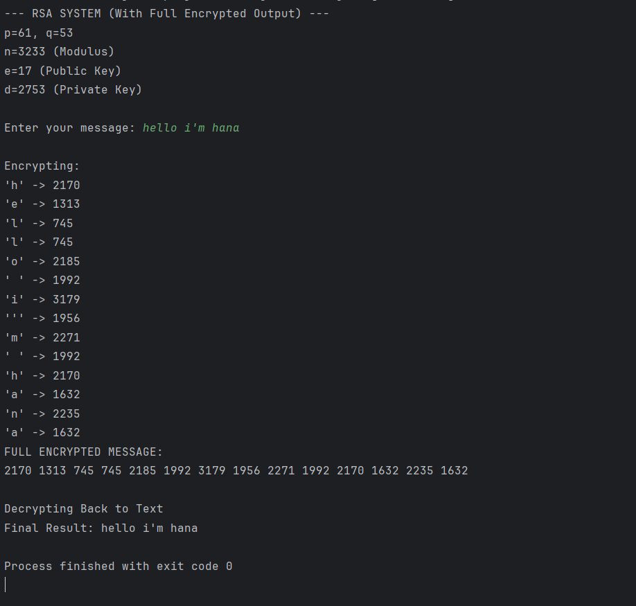

# RSA Cryptography Implementation in Java

A from-scratch implementation of the RSA public-key cryptosystem in Java. This project demonstrates the core mathematical principles behind modern encryption by building the key generation, encryption, and decryption algorithms entirely from scratch without relying on external cryptography libraries.

## 📌 Overview

This project walks through the mathematical fundamentals of RSA, including:
* **Key Generation** (Public and Private Keys)
* **Encryption** (Character-by-character ASCII encryption)
* **Decryption** (Recovering the original text)
* **Modular Arithmetic** (Custom implementations of GCD, Modular Exponentiation, and Modular Inverse)

---

## 🧠 How It Works (The Math)

The implementation strictly follows the RSA mathematical model using Java's `BigInteger` for large number calculations.

### 1. Key Generation
* **p, q**: Two prime numbers (e.g., `p = 61`, `q = 53`)
* **n = p × q**: The Modulus (`n = 3233`)
* **φ(n) = (p − 1)(q − 1)**: Euler's Totient Function
* **e**: Public exponent (`e = 17`)
* **d**: Private Key, calculated as the modular inverse: `d = e⁻¹ mod φ(n)`

### 2. Encryption
Each character of the input string is converted to its ASCII value (`m`) and encrypted individually using the public key `(e, n)`:
> **c = m^e mod n**

### 3. Decryption
The ciphertext (`c`) is converted back to the original ASCII character (`m`) using the private key `(d, n)`:
> **m = c^d mod n**

---

## 📸 System Demonstration

Below is a screenshot of the program executing in the terminal. It shows the calculated keys, the step-by-step encryption of a message, the full cipher array, and the successful decryption back to the original string.



---

## 🚀 How to Run

1. Ensure you have the Java Development Kit (JDK) installed.
2. Clone this repository and navigate to the project directory.
3. Compile the Java file:
   ```bash
   javac src/Main.java
4. Run the program:

 ```bash
java -cp src Main
```
⚙️ Project Structure & Tech Stack
Language: Java

Core API: java. math.BigInteger (Used to handle large cryptographic numbers and modular arithmetic)

File: Main.java contains the complete logic, including custom methods for gcd(), power(), and modInverse().

---

## ⚠️ Disclaimer


This project is built for educational purposes only to demonstrate how RSA mathematics work internally. It is not secure for production use because:

It uses small, hardcoded prime numbers (61 and 53).

It encrypts character-by-character without padding schemes (like OAEP).

It lacks cryptographically secure random key generation.
